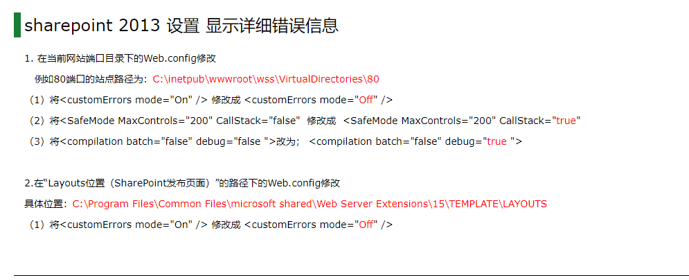

### 基本

#### 概述

企业级 基于数据存储和协同办公信息化平台软件


#### 功能

- 点赞
- 评论
- 调查问卷
- 空间使用
- 温度分析


#### 文档

[微软Office开发文档](https://developer.microsoft.com/zh-CN/office/docs)


#### 工具

sharepoint manager tool


#### 资料

##### 博客

[sharepoint blog](https://piyushksingh.com/category/sharepoint-online/)

[sharepoint 博客](http://blog.51cto.com/joycode)


##### 论坛

[论坛sharepoint板块](https://sharepoint.stackexchange.com/)


### 管理中心

#### 站点管理

##### 域名映射

映射设置


##### 文件上传

可在管理中心设置不允许上传的文件类型(根据扩展名)


### 运维

#### 网站集

```bash
#  备份
Restore-SPSite -Identity "http://10.182.21.33/sites/attendance" -Path C:\Users\farmadmin\Desktop\site\attend.bak -Force  

# 还原
Backup-SPSite -Identity "https://portal.toyotsu-ea.com" -Path C:\backup\deb\site.bak
```


#### 搜索

**Kql**

关键字查询，SharePoint根据文档名、内容进行了关键字提取，搜索时会根据搜索的关键词进行搜索，如果搜索的是非关键词则搜索不到

缺点：查询逻辑与常用的不同，关键词不明确，导致搜索不稳定,只支持前缀匹配: a*  , *a不行

 

| 普通关键字查询 |                                            |
| -------------- | ------------------------------------------ |
| 指定属性查询   | Filename:   123/ filename: "123"           |
| 双引号查询     | "123 456"和123 456，没有""会由于空格被拆分 |
| 逻辑组合       | (a) OR   (b) / (a) AND (b) /NOT            |
| 通配符查询     | a*                                         |

 

 

**Fql**

开发人员使用，默认不开放


#### 页面

**页面文字设置**

 编辑页面->编辑属性->页面内容->编辑源...


**强制重新登录**

xxx/_layouts/closeConnection.aspx?loginasanotheruser=true

> 自动登录后自动跳转顶层站点？


https://team.cargill.com/sites/Metals_Supply_China_E-chop_Test/_layouts/15/closeConnection.aspx?loginasanotheruser=true&Source=https://team.cargill.com/sites/Metals_Supply_China_E-chop_Test/eChop

> 增加source参数指定跳转


**隐藏新建item页面的字段**

list setting,在contenType中点击，进入List Content Type页面，点击字段，可以选择Hidden


**导航隐藏**

权限判断隐藏导航


```html
<Sharepoint:SPSecurityTrimmedControl ID="SPSecurityTrimmedControl2" runat="server" PermissionsString="ManageWeb">                           
          <script type="text/javascript">
             $('#suiteBarDelta').css('display', 'block'); 
          	 $("#s4-ribbonrow").css('display', 'block');
         </script>         
</Sharepoint:SPSecurityTrimmedControl>

<!-- PermissionsString 权限属性 -->
```


#### 站点

**查看站点存储**

site setting --> (转到首要网站设置) --> 存储标准 --> file    不一定准


**sharepoint文件批量下载、获取**

在文件夹中输入网页地址能直接访问sharepoint文件夹


**隐藏用户表,用户信息表**

http://192.168.20.40:8091/sites/rgciland/_catalogs/users/simple.aspx
/_catalogs/users/simple.aspx

隐藏用户表名：User Information List


**隐藏账号**

everyone: 表示所有账号		

- 默认隐藏？所以查找不出来，要实际查找点击一次才会出来
- 默认ID 13？


**模板停用**

site settingg --> solutions --> 停用


**爬虫搜索加工**

网站设置-> 母版页和页面布局-> Display Templates -> 可以找到搜索时使用的模板和js，从而对搜索结果做一些处理


#### 服务器

**日志**

日志路径：```C:\Program Files\Common Files\microsoft shared\Web Server Extensions\15\LOGS```
```ULSViewe-log```工具	查看工具


**OWA**

owa有对应的服务器、站点

> 通过获取到的css路径可以找到css，从而进行隐藏
>
> 编辑权限和读取权限的编辑按钮不同


#### 列表

**权限**

通过组可对Item项设置权限

> 文档库，断开继承，删除权限，在item项中选择分享


**导出excel**

sharepoint list export to excel   需要IE

> 导出数据到excel，进行备份
>
> 使用ie打开列表
>
> 导出下载query.iqy
>
> 使用excel打开query.iqy


**复制列表**

list setting保存模板，且包含数据

创建list,在app中查找


#### 流程

流程可以设置item权限


#### 用户

用户组和用户的lookupid应该是公用一个计数，不会重叠


#### Designer

通过站点连接进入可进入对应的站点文档库中操作

Sharepoint designer 提示不能编辑非SP网站，重启，利用网页启动


#### 账号

账号设置分布

- iis 应用池 账号设置
- windows服务账号设置
- sharepoint   邮件传出、nintex提示、UserProfile


### 列表


##### 文档库

文档库文件fileref字段是包含当前站点的，除顶层站点外


##### Item

字段名称

- 内部名称
- 显示名称


字段值类型

- 查阅项
- url
- text
- number
- bool
- .....


直接浏览器输出sharepointl 列表项数据可以看到数据对应的类型 如： SP.FieldUser...

lookup值如果当文本读取的话是id+姓名；可以这样检索到


##### 版本控制

连续更新数据时，由于隐藏的xxxx,会认为时旧版本，产生版本冲突，不能更新

解决方法，重新获取context


##### 权限

不同用户查询列表时结果不同,权限问题

[列表权限设置只控制自己创建的](https://sharepointmaven.com/how-to-enable-item-level-permissions-in-sharepoint/)


##### 阈值

[说明](https://blog.csdn.net/shrenk/article/details/39217223)


**通过索引列避免**

索引列：  可以通过索引列进行多数据操作，查询，但是结果返回值不能超过阈值
非索引列：只要数据量超过阈值就不能进行操作

- 筛选条件含有索引列后，只要通过索引列查询的最大数不超过阈值，可以添加其他非索引列的字段筛选
- 单个索引列筛选超过阈值时，可通过设置符合索引列组合筛选，只有一个索引列通过多次caml联合减少查询亦可
- 当两个非复合索引进行and查询时，先根据一个索引返回，再在返回的数据里进行另一个字段的筛选

**使用文件夹分割**


##### 限制

**文件名符号限制**

**文件名长度限制**

url最长为260？


##### 资料

[阈值相关官方文档](https://support.office.com/en-us/article/manage-lists-and-libraries-with-many-items-for-sharepoint-2010-1f4985e4-6d67-4e0c-a473-ea17e7058585?ocmsassetID=HA010378155&redir=0&CorrelationId=9a4c067a-7dbd-4deb-8a02-69b73d0255d0&ui=en-US&rs=en-US&ad=US#_Toc268174141)

[How to overcome SharePoint 5000 item limit threshold](https://sharepointmaven.com/how-to-overcome-sharepoint-5000-item-limit-threshold/)

[sharepoint 阈值查询](https://social.msdn.microsoft.com/Forums/sharepoint/en-US/db54d1c7-e19b-414d-84b9-d6c22ea3b676/how-can-i-overcome-limitations-of-list-view-threshold-when-querying-sharepoint-2013-online)

[sharepoint阈值说明](https://www.abelsolutions.com/working-with-list-view-thresholds-in-sharepoint/)

sql查询超过5000条的时候会锁定整张表  


### Webpart

#### 项目

##### 文件信息

| Featurel       | 设置要部署的控件 --> 部署后网站集功能的Featurel？ |
| -------------- | ------------------------------------------------- |
| Package        |                                                   |
| webpart        |                                                   |
| Ascx           | 控件内容                                          |
| Cs             | 控件方法、属性                                    |
| *Elements.xml* | 包含项目中的功能定义文件用于部署Web部件的信息     |


##### 项目类型

| 方案类型           | 说明                        |
| ------------------ | --------------------------- |
| Sandbox   solution | 无法部署Farm only   webpart |
| Farm   solution    |                             |


##### 映射

右键添加Layout映射，可以将c/xxxx/15(16)/xxx   下的文件夹加入来

然后在对应的地方加入文件在部署后就可以跟着部署到对应的映射文件夹下

> 实质是会在package中设置打包


**使用场景**

1、增加配置文件

> sharepoint 无法设置webconfig，可以通过自定义配置文件实现类似的功能
> 1、创建配置文件添加到映射文件下
> 2、创建读取配置文件的class，固定读取配置文件所在的陆军
> 3、建立配置文件映射class，每次读取映射class的值时检查文件是否被修改，若被修改则重新生成映射class的字段内容

2、加入静态文件

> 图片、资源、模板文件等


##### DLL部署

引入第三方/其他Project的dll时需要在package中添加dll

> 部署到全局资源：被部署到globalAssembly中
> 部署到webapplication：dll被部署到网站的bin目录下


部署后webpart DLL位置：```C:\Windows\Microsoft.NET\assembly\GAC_MSIL\xxx```
例：```C:\Windows\Microsoft.NET\assembly\GAC_MSIL\ElectronicBill\v4.0_1.0.0.0__a4a40284d968eeb0```


##### 前后端分离

一、进行WebService映射

> 创建一个空webpart,后台内容不需要写，ascx为一个div,然后引入对应的js
> 添加webService映射，asmx会被映射至对应的class中
> asmx只能进行Post请求？（通过设置webconfig和标签好像可以进行Get请求）
> 加入[script]标签可以用json进行数据交互


**webService映射设置**

1.右击SharePoint项目 -> 添加 -> SharePoint的layouts映射文件夹
2.右击layouts文件夹中的项目文件夹 -> 添加 -> 选择文本文件 -> 修改为：服务名.asmx
3.黏贴以下代码

```c#
<%@ WebService Class="SharePointProject1.Services.Test" %> //SharePointProject1为项目名称,Services为文件夹名，Test为服务名
    
<%@ Assembly Name="SharePointProject1, Version=1.0.0.0, Culture=neutral, PublicKeyToken=5bba0f5ee04ebd97"%> 
	//SharePointProject1为项目名称,PublicKeyToken需在添加WebService前先部署一次，然后从路径：C:\Windows\Microsoft.NET\assembly\项目名中，其中文件夹名下划线之后字符串
```


4.右击SharePoint项目 -> 创建Services文件夹
5.添加引用System.Web.Services
6.右击Services文件夹 -> 添加类名为服务名的类
7.黏贴以下代码到命名空间中

```c#
   [WebService(Namespace = "http://tempuri.org/")]
    [WebServiceBinding(ConformsTo = WsiProfiles.BasicProfile1_1)]
    [System.ComponentModel.ToolboxItem(false)]
    class Test: WebService //Test修改为对应的服务名
    {
        [WebMethod]
        public string T() //T为WebService接口
        {
            return "成功";
        }
    }
```


8.部署该SharePoint项目
9.在IIS中的15目录中寻找该项目中的asmx文件，并调用接口进行测试是否成功


##### JSLink

设置给webpart加上自定义js

操作：编辑页面-->编辑webpart-->最后一个选项-->最后一个配置（JS Link）

~site/xxx  ==> ~site解析到当前站点下
~sitecollection/xx ==> 解析到当前网站集（顶层站点？）
~layouts/xx ==> 解析到当前页面下的/_layouts/14  or /_layouts/15
~sitelayouts ==> 解析到当前站点下的/_layouts/14  or /_layouts/15
~sitecollectionlayouts ==> 解析到当前网站集下的/_layouts/14  or /_layouts/15


##### 问题

**提示InitializeControl不存在**

右键ascx文件，run custom tool


**对象ID重复**

右键package打开设计器，右下角可修改solution ID  guid


**feature has already installed**

点击feature文件夹下的xxxfeature,右下属性选强制安装


**step 'activate features' Failed to load receiver assembly**

右键项目属性，签名，新建强名称密钥文件，随便写名字，密码随意


**Could not load file or assembly  The system cannot find the file specified**

确实少了dll


**wsp包打包文件还原**

- 新建一个同名的sharepoint项目，自带package和feature生成
- 将package复制到需要还原的项目中，feature为空不需要
- 项目总包含package,排除其他代码文件
- 重新包含其他代码文件
- webpart需在package设计页面中拉取
- 部署


**版本问题？ 部署后aspx中的aspx无效**

要移动到layout下


**webpart打包，在wsp中添加依赖的dll**

选择package --> 高级 --> 添加


#### 部署


##### 部署步骤

```bash
# C:\xxx.wsp 为电脑上存放wsp的路径
# xxx.wsp	为wsp的名称	
# siteUrl	为部署的网站地址
```


**首次部署**

```bash
stsadm -o addsolution -filename C:\xxx.wsp # 添加解决方案
stsadm -o deploysolution -name xxx.wsp -immediate -url siteUrl  -allowGacDeployment #部署解决方案
```


**二次部署**

```bash
stsadm -o retractsolution -name xxx.wsp -immediate -url  siteUrl # 收回解决方案
stsadm -o deletesolution -name xxx.wsp # 删除解决方案
stsadm -o addsolution -filename C:\xxx.wsp # 添加解决方案
stsadm -o deploysolution -name xxx.wsp -immediate -url siteUrl  -allowGacDeployment # 部署解决方案


```


收回解决方案：stsadm -o retractsolution -name xxx.wsp -immediate -url  siteUrl
删除解决方案：stsadm -o deletesolution -name xxx.wsp
添加解决方案：stsadm -o addsolution -filename C:\xxx.wsp
部署解决方案：stsadm -o deploysolution -name xxx.wsp -immediate -url siteUrl  -allowGacDeployment


#####  问题

**无法部署**

打开浏览器管理，进入系统设置  ---  管理场解决方案  --- 处理  


#### 配置

webpart属性设置可以设置参数


### 交互模型

csom,jsom,update后会自动更新对象内容

[SharePoint 模型对比](https://docs.microsoft.com/zh-cn/sharepoint/dev/general-development/choose-the-right-api-set-in-sharepoint#client-object-models-for-managed-code)


#### Caml

##### 排序

查询条件中每个字段按照排列的顺序依次为首要查询条件、次要查询条件、第三查询条件


##### 嵌套

嵌套层数不能超过160！===> 最多2^160的条件


##### RowLimit

rowlimit 返回的记录条数，默认为100，如果不需要限制，将值设为0


##### 查询范围

**Scope**

- Recursive:遍历所有文档 
- RecursiveAll:遍历所有文档和文件夹


**指定文件夹**

```C#
query.Folder = docLib.RootFolder.SubFolders["system"];
```

```js
camlQuery.set_folderServerRelativeUrl(folderPath) 
// "/site/list/folder"   需包含站点
```


##### 操作符

**In**

in条件内部超过500不行 	   in可以查lookup


##### 类型查询

**时间**

使用SPQuery查询时间，默认查询会忽略 时分秒，只检查日期，如果要检查时间，则必须添加 IncludeTimeValue='TRUE'

[caml datetime处理，搜索对比](http://www.cnblogs.com/qijiage/p/4059462.html)


**查阅项数组**

对于多选查阅项和多选用户也应使用Eq操作符

查阅项可以用in操作判断，查阅项数组用in亦可


**FSObjType**

0:文档 1：文件夹


##### 阈值

2010引入了列表视图阈值，通过限制可查询和显示的列表数据量，有助于保持 SharePoint 服务器的良好运行

**why**

当查询大量的项目而没有合适的索引时，在对列表进行排序和/或筛选时，sqlserver 必须扫描数据库表中所有记录(即 SharePoint 列表中的所有项)中的排序/筛选字段,在大约5,000个项目之后，sqlserver 通常确定应用表锁来解决争用问题更有效,会导致阻塞其他用户，影响并发性能
> 会触发锁升级（Lock Escalations）


- caml查询第一个条件必须筛选到阈值以下(复合索引未知)
- caml设置路径后可以RecursiveAll和Recursive，在指定路径下进行
  时间索引可用来筛选
- ContentType可以设置索引，区分文件夹
- filedirref不能加索引，也不能作索引进行查询
- In可以用于索引筛选
- lookup value不能被索引到  


**加索引后功能与预期有差异，有的字段3k超阈值，有的可以超4k?**

未解决


##### 索引

索引设置后，caml查询时可能对字段类型有一致要求

索引对查阅项有效


##### 分页

[分页](https://code.msdn.microsoft.com/SharePoint-JSOM-list-5104ca92)

```js
下一页的pageinfocollListItem.get_listItemCollectionPosition().get_pagingInfo()
// 获取下一页的pageinfo
// 总是返回往下翻页的翻页信息，但是当是往上翻页时，要取15条，但只有14条时，翻页信息会为空
```


**pageinfo**

分页排序与不排序只差了查询条件和在pageinfo中的排序字段信息

如果有多个排序则继续按相应的格式进行拼接


```js
var nextPageInfo = "Paged=TRUE&p_ID=218"
var prevPageInfo = "PagedPrev=TRUE&Paged=TRUE&p_ID=208"
// 排序继续添加&p_field=value
```


```c#
var clientContext.Load(listItems,items => items.Include(item => item.Id), items => items.ListItemCollectionPosition);
var pos =  spItems.get_listItemCollectionPosition()	
    // 可以知道有没有下一页,为null则没有下一页了
    
// 取GUID
SPList list = web.Lists["test"];
Guid id = list.ID;
```


##### 资料

[列表查询中的阈值限制](http://www.myexception.org/sharepoint/1905232.html)

[caml groupby](https://piyushksingh.com/2016/11/21/retrieve-grouped-listitems-sharepoint/)

[joins,列表多表联合查询](https://blog.csdn.net/linyustar/article/details/28232229)

[rest api文档库文件上传，下载，拷贝，剪切，删除文件，创建文件夹，修改文件夹属性，删除文件夹，获取文档列表](https://www.cnblogs.com/dmyao/p/7069944.html)

[camljs archive](https://archive.codeplex.com/?p=camljs)

[camljs github](https://github.com/andrei-markeev/camljs)

[camljs console](https://www.crx4chrome.com/crx/5002/)

[camlsql-js github](https://github.com/dlid/camlsql-js)

[caml C# SPQuery对象](https://archive.codeplex.com/?p=camldotnet)

[caml view子属性](https://www.cnblogs.com/erucy/p/4439016.html)

[查询-1](https://www.cnblogs.com/erucy/p/4296940.html)

[查询-2](https://www.cnblogs.com/erucy/p/4439016.html  )

[查询](https://www.cnblogs.com/jaxu/archive/2009/03/23/1419717.html)

[caml查询 Sharepoint文档的CAML分页及相关筛选记录](https://www.cnblogs.com/poissonnotes/p/3494439.html)

[caml一些使用，关键词](https://www.cnblogs.com/carysun/archive/2011/01/12/moss-caml.html)

[SharePoint服务器端对象模型 之 使用CAML进行数据查询](https://www.cnblogs.com/liyuxin/p/5575950.html)

[官方文档](https://docs.microsoft.com/zh-CN/sharepoint/dev/schema/collaborative-application-markup-language-caml-schemas)


#### CSOM


##### 操作

**UpdateItem**

更新前的设置操作必须连续


**批量操作**

csom可以批量修改,并且跨表修改也可以
当只修改一个表时，在update时就会马上更新，
但是马上去修改另一个表的话，执行完update()并不会马上生效
最后调用exectquery()可以确保数据更新


#### JSOM

##### 使用要求

**基础**

- ```Init.js```
- ```MicrosoftAjax.js```
- ```Sp.runtime.js```
- ```Sp.js```


**插件**

- ```SP.UserProfiles```:需加载```_layouts/15/SP.UserProfiles.js```
- 弹框：```Sp.ui.js```

- 使用原生列表Webpart：```Sp.init.js```
- [sharepoint Dialog](https://docs.microsoft.com/en-us/previous-versions/office/developer/sharepoint-2010/ff410058(v=office.14))

**位置**

一般位于```_layouts/15/###.js```下


##### 基础

**contextInfo**

```contextinfo```只是认证信息


**context**

- 通过相对路径可以取子站点
- 绝对路径可以取当前站点和子站点
- 获取父站点```get_parentweb```


##### 方法

**等待加载**

```js
SP.SOD.executeFunc() // 等待加载函数,在init.js
```


##### 通用列表操作

**选项读取**

castTo(...)   获取字段所有选项


**对象数据读取**

```js
// 读取文档库
//以对象形式读取所有属性,返回{xx:xx,xx:xx}
item.get_objectData()
id.get_methodReturnObjects()
i.$m_dict.xxxxx

// get_fieldValues()  获取所有属性
```


##### 文件操作

**签入签出**

```js
item.File.CheckOut();
clientContext.ExecuteQuery();
item["Sprakkode"] = theValue; //UPDATE OPERATION GOES HERE
item.Update();
clientContext.ExecuteQuery();
item.File.CheckIn("", CheckinType.MajorCheckIn);
item.File.Publish("");
clientContext.ExecuteQuery();
```


**隐藏附件**

通过Attachment字段存储文件

实际是会创建一个隐藏的文件夹来存放文件


```js
var ctx = SP.ClientContext.get_current();
var web = ctx.get_web();
var oListActiveMatter = web.get_lists().getByTitle("Test");
var camlQuery = new SP.CamlQuery();    
var viewXml = String.format("<View><Query><Where><Eq><FieldRef Name='ABCNumber' /><Value Type='Text'>{0}</Value></Eq></Where></Query></View>", "1232");
camlQuery.set_viewXml(viewXml);
var oListItems = oListActiveMatter.getItems(camlQuery);
ctx.load(oListItems);
ctx.executeQueryAsync(function () {
    var oListItemEnumerators = oListItems.getEnumerator();
    while (oListItemEnumerators.moveNext()) {
        var item = oListItemEnumerators.get_current(); 
        var createdBy = item.get_item('Author');
        var createdDate = item.get_item('Created');
        var modifiedBy = item.get_item('Editor');
        var modifiedDate = item.get_item('Modified');
        //debugger;
        var attachmentFiles = item.get_attachmentFiles();
        ctx.load(attachmentFiles);
        ctx.executeQueryAsync(function () {
            debugger;
            if(attachmentFiles.get_count() > 0){
                var attachmentsItemsEnumerator = attachmentFiles.getEnumerator();
                while (attachmentsItemsEnumerator.moveNext()) {
                    var attachitem = attachmentsItemsEnumerator.get_current(); 
                    var fileName = attachitem.get_fileName();
                    var filepath = attachitem.get_path();
                    var serverPath = attachitem.get_serverRelativePath();
                    var serverUrl = attachitem.get_serverRelativeUrl();
                    var objetctData = attachitem.get_objectData();
                    var typedObj = attachitem.get_typedObject();
                }
            }
        });
    }
    console.log(oListItems.get_count());
});
```


**文件上传**

单个文件上传不能超过2M，rest为2G


##### 问题

**重复引入**

sp继承母版页，会自动引入所需的js，再重复手动引入可能会引用问题


**版本冲突**

更新前获取getbyid可以避免版本冲突，但是先getbycaml,再update则不行

updateListItemByCaml，由于共用上下文信息所以可以不受版本冲突影响?


**0x80131904**

- ```Exception from HRESULT: 0x80131904```：caml中值问题，例lookupid使用了字符串

> 数据类型/格式设置异常，查阅项不是ID/日期字符串格式异常

- 字段不允许插入？？？（待验证，例修改自带Created字段）


##### 资料

[jsom操作示例](http://www.thesharepointguide.com/sharepoint-javascript/#userperms)

[读取列表权限](https://sharepoint.stackexchange.com/questions/129309/how-to-get-permission-of-a-sharepoint-list-for-a-user-using-rest-api/129311#129311)

[权限枚举](https://docs.microsoft.com/en-us/previous-versions/office/developer/sharepoint-2010/ee556747(v=office.14))

[查阅项更新](https://social.msdn.microsoft.com/Forums/en-US/7e7f359b-2e8d-44d2-8cb3-816852d4a06c/sharepoint-update-lookup-column-jsom?forum=sharepointdevelopment)

[update  多个lookupvalue](https://stackoverflow.com/questions/22694749/sharepoint-2013-multivalue-lookup-field-with-javascript)

[微软官方jsom操作](https://docs.microsoft.com/en-us/sharepoint/dev/sp-add-ins/complete-basic-operations-using-javascript-library-code-in-sharepoint#create-read-update-and-delete-files)

[文档库操作1](https://sharepoint.stackexchange.com/questions/157769/adding-a-new-item-to-a-document-library-using-jsom)

[文档库操作2](https://stackoverflow.com/questions/29699830/get-file-name-from-document-library
http://ramdotnetdeveloper.blogspot.com/2017/07/to-get-file-and-folder-from-document.html)

[How to get sharepoint file from document library if I know file url (JSOM)?](https://sharepoint.stackexchange.com/questions/209170/how-to-get-sharepoint-file-from-document-library-if-i-know-file-url-jsom)

[Uploading file to document library using JSOM](https://sharepoint.stackexchange.com/questions/213789/uploading-file-to-document-library-using-jsom)

[微软jsom含有文件操作](https://docs.microsoft.com/zh-cn/sharepoint/dev/sp-add-ins/complete-basic-operations-using-javascript-library-code-in-sharepoint#create-read-update-and-delete-files)

[Using JavaScript or JQuery and JSOM in SharePoint](http://www.thesharepointguide.com/sharepoint-javascript/#querying-list)

[Working with the ECMAScript Client Object Model (JSOM) in SharePoint 2010](https://docs.microsoft.com/de-de/previous-versions/office/developer/sharepoint-2010/hh372944(v=office.14))

[Top 51 JSOM SharePoint Examples ](https://www.sharepointsky.com/jsom-sharepoint/)

[SharePoint Online: JSOM Examples](http://www.migee.com/2016/03/20/sharepoint-online-jsom-examples/#SPWebPerms)


#### Rest

##### 常用操作

**move + copy**
1、可选所有的站点：搜索所有的站点（子站点下的子站点都可选，拍平）
2、可选站点下所有文档库：搜索所有文档库
3、进入文档库后可创建文件夹	必要
4、move/copy 支持批量操作：CreateCopyJobs api	必要
5、目标路径面包屑导航	必要
6、文件夹可move/copy：紧复制文件夹	必要
7、进度查看：GetCopyJobProgress api
8、oneDrive


[CreateCopyJobs](https://gist.github.com/zplume/21248c3a8a5f840a366722442cf9ee97)


**Caml查询**

```js
fetch(
`http://eip.carsgen.com/Management/InfoTechnal/_api/web/GetList(@listUrl)/RenderListDataAsStream?@listUrl='/Management/InfoTechnal/KnowledgeLibrary'`,
{
method: "Post",
headers: {
accept: "application/json;odata=nometadata",
"content-type": "application/json;odata=nometadata"
},
body: JSON.stringify({
parameters: {
ViewXml: `<View Scope='RecursiveAll' ><Query><Where><Contains><FieldRef Name='FileLeafRef' /><Value Type='Text' >16Z</Value></Contains></Where></Query><RowLimit>1</RowLimit></View>`
}
})
}
);


// pnp使用
sp.web.lists.getByTitle("信息技术部文档库").renderListDataAsStream({
ViewXml: `<View Scope='RecursiveAll' ><Query><Where><Contains><FieldRef Name='FileLeafRef' /><Value Type='Text' >16Z</Value></Contains></Where></Query><RowLimit>1</RowLimit></View>`
});
```


##### 问题

**请求大小写**

请求地址大小写敏感(主要是batch请求时？)


**转义**

更新时字段内容不能含有"\\"  转义字符


##### 库

[pnpjs](https://github.com/pnp/pnpjs)
[pnpjs io](https://pnp.github.io/pnpjs/)	

> pnp.js要在线下版本的sp上运行，且在node.js运行时，由于原生的是支持线上版sp的，需要使用sp-pnp-node来创建认证信息


##### 资料

[rest api odata](https://docs.microsoft.com/zh-cn/previous-versions/dynamicscrm-2015/developers-guide/gg490659(v%3dcrm.7))

https://blog.csdn.net/zhoulu001/article/details/53189085

https://www.cnblogs.com/fengzheng/p/3149717.html

http://www.cnblogs.com/wolf-sun/p/4603199.html  

[rest api说明](https://docs.microsoft.com/en-us/sharepoint/dev/sp-add-ins/working-with-folders-and-files-with-rest)

[微软rest api odata查询](https://docs.microsoft.com/en-us/sharepoint/dev/sp-add-ins/use-odata-query-operations-in-sharepoint-rest-requests
https://blog.csdn.net/abrahamcheng/article/details/12612455)

[rest上传文件 ](https://docs.microsoft.com/en-us/sharepoint/dev/sp-add-ins/upload-a-file-by-using-the-rest-api-and-jquery)

[rest api 更新文档库的列表项会不同](http://www.cs.yale.edu/homes/aspnes/classes/223/notes.html)

[How to Check User Permission in SharePoint 2013 Using REST API](https://www.c-sharpcorner.com/UploadFile/sagarp/how-to-check-user-permission-in-sharepoint-2013-using-rest-a/)


#### 问题

##### Feature id xxx Is not installed farm

应该是安装不了？考虑通过命令安装，或者停掉iis等，去除影响因素后安装


##### 部署时提示Webconfig无法？？？

停掉iis，或者webapplication servicea


##### get_layoutsLatestVersionUrl  undefined

1、引入sp.init.js
2、sp.core.js删除
3、SP.Utilities.VersionUtility = {}; SP.Utilities.VersionUtility.layoutsLatestVersionUrl  = () => {}

##### 启动流程超时

流程操作超时： 服务器流程服务问题


##### 错误信息显示，Debug模式




##### 搜索结果预览的时候遮罩层不隐藏

Nintex自带的代码产生的遮罩层，可能有Bug导致不隐藏


##### AD组用户变更后 SharePoint没有及时生效

1. User Profile Service      Full sync
2. CA- > Service applications      -> user profile Service -> start profile sync(under sync) ->      start full sync
3. <https://sergeluca.wordpress.com/2013/07/06/sharepoint-2013-use-ag-groups-yes-butdont-forget-the-security-token-caching-logontokencacheexpirationwindow-and-windowstokenlifetime/
4. <https://sharepoint.stackexchange.com/questions/76313/users-added-to-ad-group-not-granted-access-in-sharepoint>


##### 网站使用率报告问题

1. <https://social.technet.microsoft.com/Forums/en-US/1b42b517-79cc-43b9-b6f0-2e4639461cb1/empty-usage-data-in-sharepoint-2013>


##### 清除登陆Token（解决AD组用户变化及时更新问题）

clear-spdistributedcacheitem -containerType DistributedLogonTokenCache


##### Sharepoint designeder 连不上服务器，提示xxx

代理会影响designeder连接服务器


##### 流程删除

先删除item项，才能删work flow task数据，否则会自动产生新数据


##### Sp-rest-proxy

请求失败、查看返回的html，有可能是账号、密码出错


#### Workflow

启动Workflows can use app permissions   active  服务才能让管理员启动流程


流程状态

在item项中选 …  ,选择workflow,  可以进入流程信息界面，查看流程状态

未开始、已完成、挂起

流程详细界面

在流程状态界面选择对应的流程，进入对应的详细信息界面，可以查看到异常的提示信息

流程终止

在流程详细信息界面，选择stop  workflow

启动

流程状态界面，选择流程，进入流程启动界面，点击启动


#### 原生功能

**SharePoint登出**

a标签，href = /_layouts/SignOut.aspx