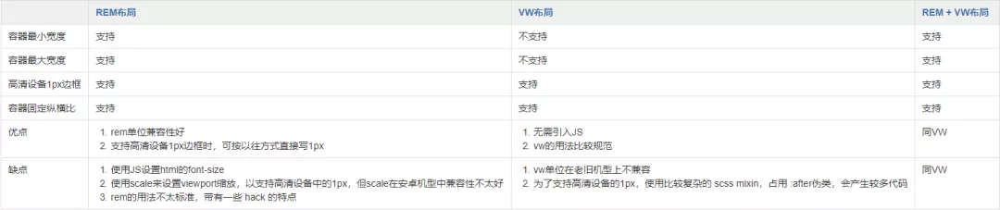

#### 优化

##### 标准

1、页面初载时，所有未压缩的 JavaScript 脚本大小：<=200KB；

2、页面初载时，所有未压缩的 CSS 资源大小：<=100KB；

3、HTTP 协议下，请求资源数：<=6 个；

4、HTTP/2 协议下，请求资源数：<=20 个 ；

5、90%的代码利用率（也就是说，仅允许 10% 的未使用代码）；

> 代码利用率 = 你页面中实际被执行的代码 / 你页面中引入的代码 * 100%
>
> chrome 开发工具 Cmd + Shift + P or Ctrl + Shift + P --> 输入Coverage可以查看使用率工具

##### 骨架屏

[骨架屏自动生成](https://mp.weixin.qq.com/s/4DAlmuMzyNjDKvaoOU1GoA)

#### 网络情况

online  offline 事件

#### base64
base64 是被编码到 css/js 中，是可以缓存的
一般超过5kb的就不推荐base64嵌入显示

#### 布局

postcss-px-to-viewport

##### 响应式和自适应
响应式	
> RWD 倾向于只改变元素的外观布局，而不大幅度改变内容

自适应	
> AWD 有可能会针对移动端用户减去内容，减去功能

#### 缓存
加入hash后，不会有缓存问题，但是发布于新版时，由于是按需加载，如果清掉旧版本的js，当浏览器没刷新时，会找不到js

#### 架构

##### 分层

业务层、services层、实体层、数据清洗层（拓展出应对不同端的数据清洗？Indexdb,api…..）

view层尽量轻

#### W3C

W3Schools 跟 W3C 组织没有关系

W3CSchool 是 W3C 中国社区的成员

#### SourceMap

sourceMap:报错信息显示正确的变量名、行数

- inline 是以dateURL的形式添加map，不额外生成map文件
- cheap     是没有列信息
- module 是包含了loader的sourcemap
- source-map     则是映射到源文件

